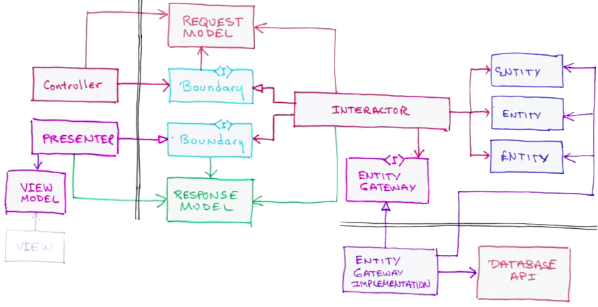

# Clean Architecture

Базовое описание дается в статье  https://8thlight.com/blog/uncle-bob/2012/08/13/the-clean-architecture.html.

Подробности можно узнать в этих материалах:

+ https://www.amazon.com/Clean-Architecture-Craftsmans-Software-Structure/dp/0134494164
+ https://cleancoders.com/episode/clean-code-episode-7/show


## Комментарии

Clean Architecture базируется на DIP принципе SOLID.

Может быть больше или меньше слоев, но Dependency Rule должно соблюдаться.

***

Понять как разделить логику между слоями Entities и Use Cases можно по следующему правилу.
Если бизнес-правило существует без автоматизации, то оно относится к слою Entities.
Если бизнес-правило содержит элементы автоматизации, вроде рассылки писем, подразумевает
наличие пользователя системы, то оно относится к слою Use Cases.

Представьте, что компьютеры еще не изобретены и вы владелец банка.
Естественно, что есть некие бизнес-процессы, например, перевод денег со счета на счет.
В помещении располагается картотека, а клерк ищет карточки клиентов,
проверяет баланс и проводит операцию перевода.
Таким образом парвило перевода денег относится к Entities.

Но может быть и Use Case, использущий правила уровня Enities.
Например, текущий пользователь системы переводит деньги другому пользователю,
при этом получатель должен получить уведомление.

***

Под сценарием(use case) тут пониматеся один запрос к системе(backend).

Т.е. это не сценарий:
+ пользователь переходит на страницу входа в систему
+ пользователь вводит логин и пароль, нажимает на кнопку войти
+ переходит на страницу перевода денег
+ выбирает получателя
+ ...

***

Use Case не могут вызывать друг-друга.
При взгляде на код сценария мы должны видеть все его шаги.
Никто не запрещает выносить общий код в службы(service).

***



Пример на ruby:

```ruby

class Interactor
  def initialize(presenter)
    @presenter = presenter
  end

  def call(request_model)
    response_model = do_smth(request_model)
    presenter.present response_model
    nil
  end
end


presenter = Presenter.new
interactor = Interactor.new presenter
controller = Controller.new interactor
request = Request.new
controller.process request
view_model = presenter.view_model
veiw = View.new
view.deliver view_model
```

При таком подходе получается, что сценарий устанавливает презентеру `response_model`.
Т.е. презентер имеет состояние. Такой подход полезен в статических языках, ведь
презентер никак не связан с контреллером и наоборот.

Но в динамических и особенно в функциональных языках такой подход выглядит странным.
И можно поступить следующим образом:

```clojure
(defn build-controller [interactor presenter view]
  (fn [request]
    (let [request-model  (do-smth request)
          response-model (interactor request-model)
          view-model     (presenter response-model)]
      (view view-model))))

(defn interactor [request-model]
  (let [response-model (do-smth request-model)]
    response-model))

(defn presenter [response-model]
  (let [view-model (do-smth response-model)]
    view-model))

(defn view [view-model]
  (let [html-string (do-smth view-model)]
    html-string))

(let [controller (build-controller interactor presenter view)]
  (controller request))
```

Т.е. интерактор, котнтроллер, презентер и представление функции без состояния.
При этом контроллер знает о "интерфейсе" презентера и представления,
но этот интерфейс - просто функция одного аргумента.
При этом не нарушается DIP.
